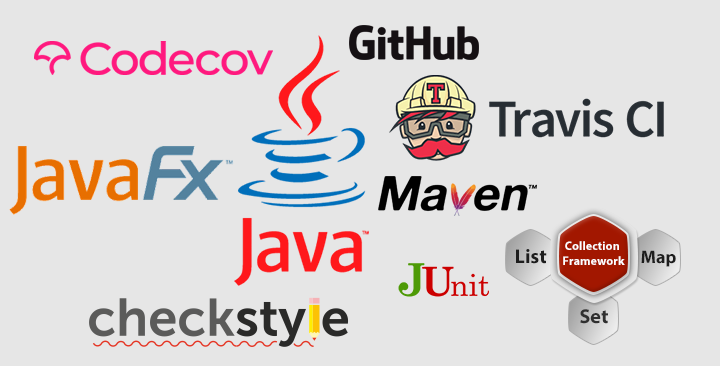

# Программист Вдовиченко Виктор
Начал стажировку на курсе Java разработчика http://job4j.ru 
Ниже перечислены проекты, реализованые мной во время стажировки. 
Проекты будут добавляться по мере реализации.

## Уровень "Стажер"
**Мои ожидания:**
>Научиться использовать инструмент сборки **Maven**. Писать модульные тесты и оформлять свой код,
> так как это делают профессионалы. Освоить базовые принципы построения программы через 
>объектно-ориентированный подход. Изучить **Java Collections Frameworks**. 
>Уверенно применять **GitHub**. Выполнять рефакторинг кода с применением шаблонов проектирования.

**Мои достижения:**

[chapter_001](https://github.com/ViktorJava/job4j/tree/master/chapter_001) - Базовый синтаксис языка: Типы данных, 
операторы условия, циклы, массивы.
 
**Задания выполненные в процессе прохождения блока:**

* введение в Java технологию
* основные синтаксические элементы языка Java (идентификаторы, типы данных, преобразования типов, операторы)
* работа со средой разработки Intellij Idea
* установка и настройка инструмента сборки проектов Maven
* файл конфигурации pom.xml. Жизненный цикл проекта и основные его фазы (clean, validate, compile, test, install)
* проверка стиля оформления кода системой Checkstyle
* введение в работу с системой контроля версий Git. Регистрация аккаунта и получение SSH ключа
* модульное тестирование. Применение пакетов JUnit, Hamcrest
* доработка существующей игры "Сокобан". [GitHub](https://github.com/ViktorJava/games_oop_javafx)

[chapter_002](https://github.com/ViktorJava/job4j/tree/master/chapter_002) - ООП: классы и объекты.

**Задания выполненные в процессе прохождения блока:**
* разработка проекта работы с заявками, Tracker
* шаблоны проектирования: Стратегия, Декоратор, Singleton, Фабричный метод, Абстрактная фабрика
* наследование
* инкапсуляция
* полиморфизм
* абстрактные, внутренние и анонимные классы
* исключения
* доработка существующего проекта "Шахматы". 
[Git](https://github.com/ViktorJava/games_oop_javafx)

[chapter_003](https://github.com/ViktorJava/job4j/tree/master/chapter_003) - Collections Framework. 

**Задания выполненные в процессе прохождения блока:**
* телефонный справочник на базе ArrayList. 
* очередь с приоритетом на LinkedList.
* конвертация ArrayList в двухмерный массив.
* конвертация двумерного массива в ArrayList.
* Generics.
* внедрение Collections in Tracker project.
* преобразования List в Map.
* сортировка в коллекциях.
* JaCoCo. Процент покрытие тестами.
* Travis CI.
* peer review and code review.
* разработка модели для банковской системы.

[chapter_004](https://github.com/ViktorJava/job4j/tree/master/chapter_004) - FP, Labmda, Stream API.

**Задания выполненные в процессе прохождения блока:**
* Labmda. 
* функции высшего порядка. 
* внедрение Consumer в Tracker project.
* Stream API.
* проект: список адресов в тур.компании. 
* проект: фильтрация учеников.
* **Jdk 1.9, 1.10** Нововведения.

## Инструменты
 
	
## [Лицензия](https://github.com/ViktorJava/job4j/tree/master/LICENSE)
MIT

<mark>Free Software, Hell Yeah!</mark>

---

>e-mail:[gmail.com](mailto:gipsyscrew@gmail.com) &nbsp;&middot;&nbsp;
>fb:[Facebook.com](https://www.facebook.com/viktor.vdovichenko) &nbsp;&middot;&nbsp;
> GitHub:[@ViktorJava](https://github.com/ViktorJava) &nbsp;&middot;&nbsp;
> OK:[Odnoklassniki](https://ok.ru/profile/571539586668)

